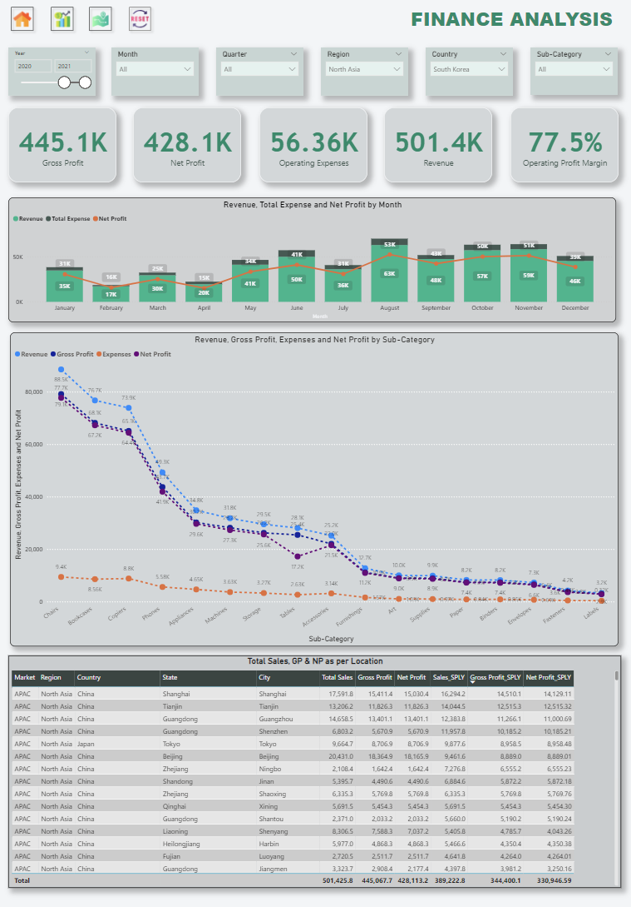
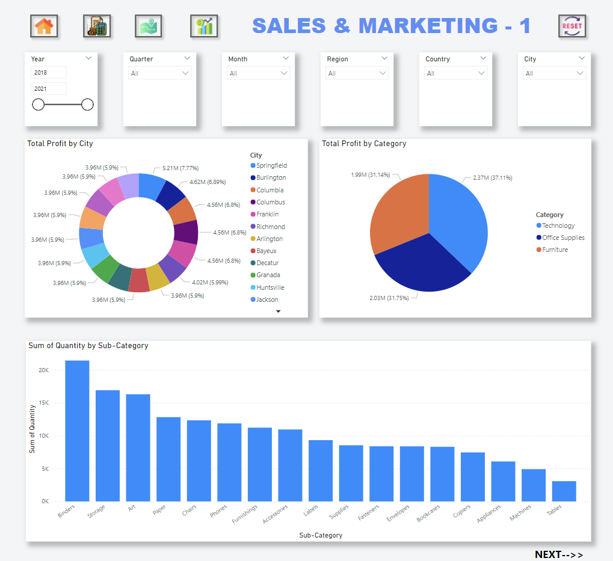
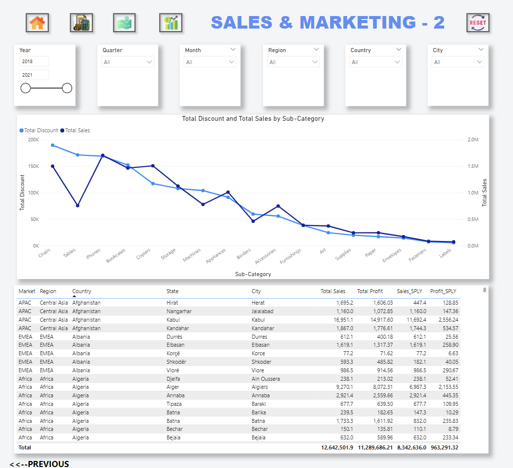
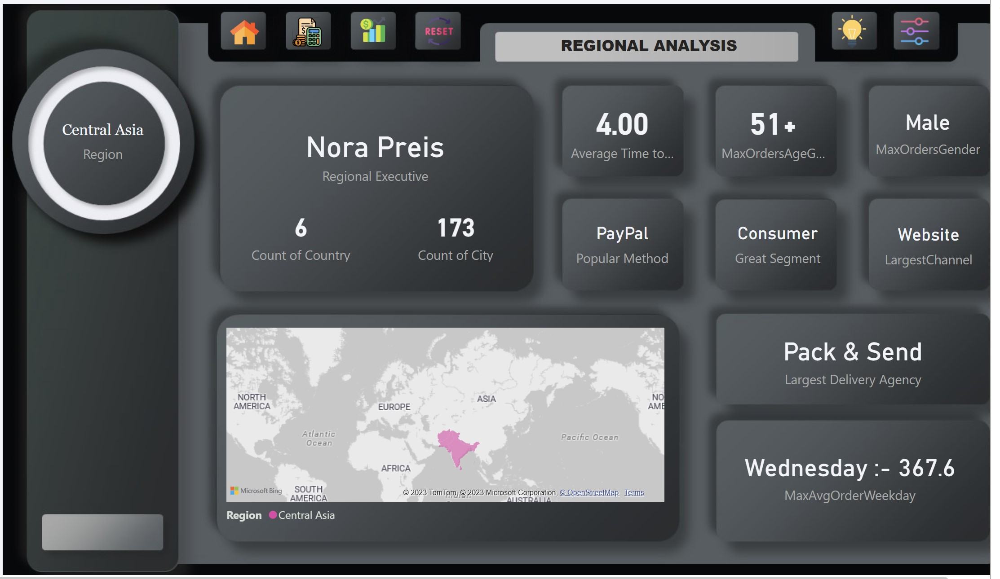
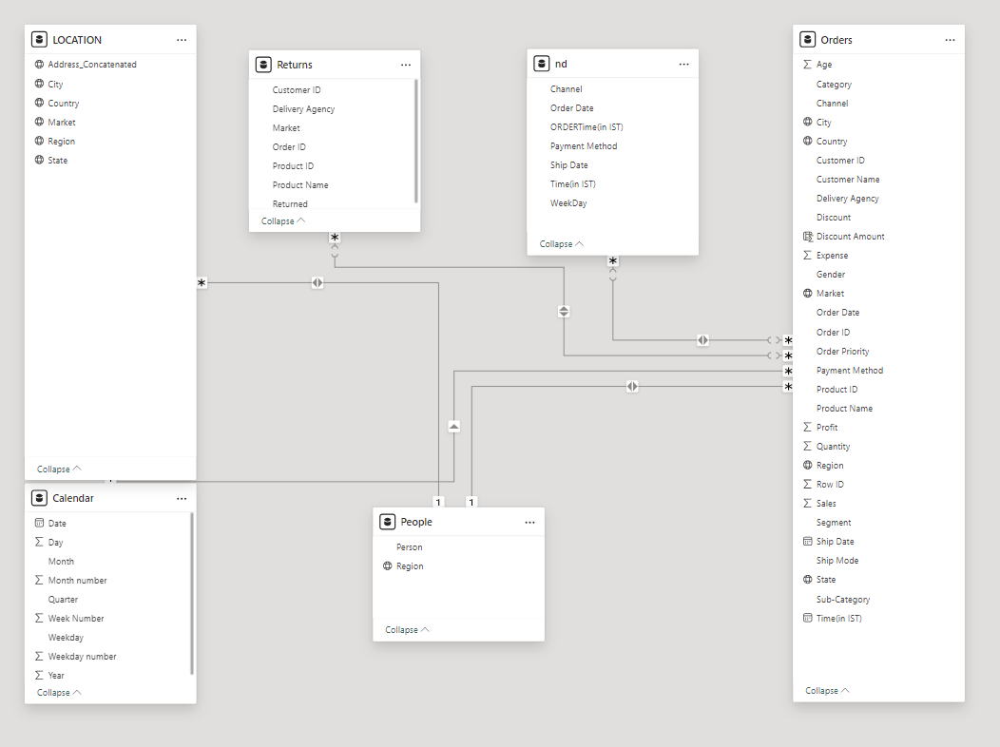

# 🌟 E-commerce Power BI Dashboard 🌟

## 🚀 Project Overview

Welcome to the **E-commerce Power BI Dashboard**, an interactive tool designed to provide critical insights into e-commerce operations. Featuring **Dark** and **Light Mode** options and an **optimized filters panel**, this dashboard offers an engaging, intuitive experience for analyzing financial, sales, marketing, and regional data.

Explore key performance indicators (KPIs) through the following dashboards:
- **Finance Dashboard**
- **Sales & Marketing Dashboards**
- **Regional Analysis Dashboard**

---

## 🛠️ Getting Started

### ⚙️ Requirements
- **Power BI Desktop** (version 2.137.751.0 or higher)
- A sample **E-commerce dataset** (or use your own)

### 💻 Usage
1. Download and open the `.pbix` file in Power BI Desktop.
2. Use the filters panel to explore data by time, region, and customer segments.
3. Toggle between **Dark** and **Light Mode** for optimal viewing.
4. Dive into the various dashboards to uncover insights about finance, sales, and regional performance.

---

## ✨ Key Features

### 🌑 Dark and Light Mode
- **Seamless theme switching**: Tailor the dashboard's appearance with dynamic dark and light themes, ensuring comfortable viewing.

### 🎛️ Optimized Filters Panel
- The **filters panel** is designed for efficiency, enabling quick filtering by region, customer segments, and time periods.
- .png)

### 💰 Finance Dashboard
- Track **profit margins**, **operating expenses**, **return on equity (ROE)**, and more, all in one place.
- 

### 📊 Sales & Marketing Dashboards
- Analyze sales metrics like **growth rate**, **total sales**, and **average order value**.
- Evaluate marketing effectiveness with metrics like **leads**, **conversion rates**, and **opportunities**.
- 
- 

### 🌍 Regional Analysis Dashboard
- Compare sales performance across regions, view **average order values**, and spot top-performing regions, with theme toggling for visual flexibility.
- 

### 🗺️ Data Model View
- Get a clear view of how your data tables relate to each other, including `Orders`, `Returns`, `Location`, and `People`.
- 

---

## 📊 Data Sources

The dashboard leverages the following data types to deliver powerful insights:
- **Sales Data**: Revenue, order details, and profits
- **Marketing Data**: Campaign performance and conversion rates
- **Regional Data**: Sales breakdown by geographic location

---

## 📈 Key Measures

### 📦 Channel Measures
- **LargestChannel**: The channel with the most orders.
- **MaxOrderChannel**: Maximum orders placed via any single channel.

### 🛍️ Customer Measures
- **Average Time to Conversion (in Days)**: Time taken for customers to convert.
- **C_Total Customers**: Total customer count.
- **New Customers**: Number of new customers acquired.

### 🚚 Delivery Measures
- **Delivery Percentage**: Percentage of deliveries completed on time.
- **Largest Delivery Agency**: Delivery agency with the highest order volume.

### 💵 Finance Measures
- **F_Debt-to-Equity Ratio**: Proportion of debt to equity.
- **F_Gross Margin**: Gross profit as a percentage of sales.
- **F_Net Profit**: Net profit after all expenses.
- **F_Return on Equity (ROE)**: Profitability relative to shareholders' equity.

### 📊 Sales Measures
- **S_Avg Sales**: Average sales value.
- **S_SalesGrowthRate**: Rate of sales growth.
- **S_Total Sales**: Total sales for the selected period.
- **S_TotalUnitsSold**: Number of units sold.

---

## 🔧 Installation

1. Clone or download this repository.
2. Open the `.pbix` file in **Power BI Desktop**.
3. Customize the data sources to match your own dataset.
4. Explore and interact with the dashboard in Power BI.

---

## 🌱 Future Improvements

We’re planning to introduce even more advanced features:
- **Automation**: Enable real-time data updates.
- **Enhanced Filters**: Add more segmentation options.
- **Interactive Insights**: Introduce additional interactive elements.
- **Predictive Analytics**: Incorporate forecasting for sales and finances.
- **Live Data Integration**: Link real-time data feeds to keep dashboards up-to-date.
- **Custom Metrics**: Allow users to add their own KPIs and metrics.

---

## 🤝 Contributing

Contributions are welcome! If you have suggestions for improvements or new features, feel free to:
- Open an issue
- Submit a pull request

Check the [CONTRIBUTING.md](CONTRIBUTING.md) for more details.

---

## 📜 License

This project is licensed under the MIT License. See the [LICENSE](LICENSE) file for details.

---

**Enjoy exploring the data with the E-commerce Power BI Dashboard!** 🛍️📊
